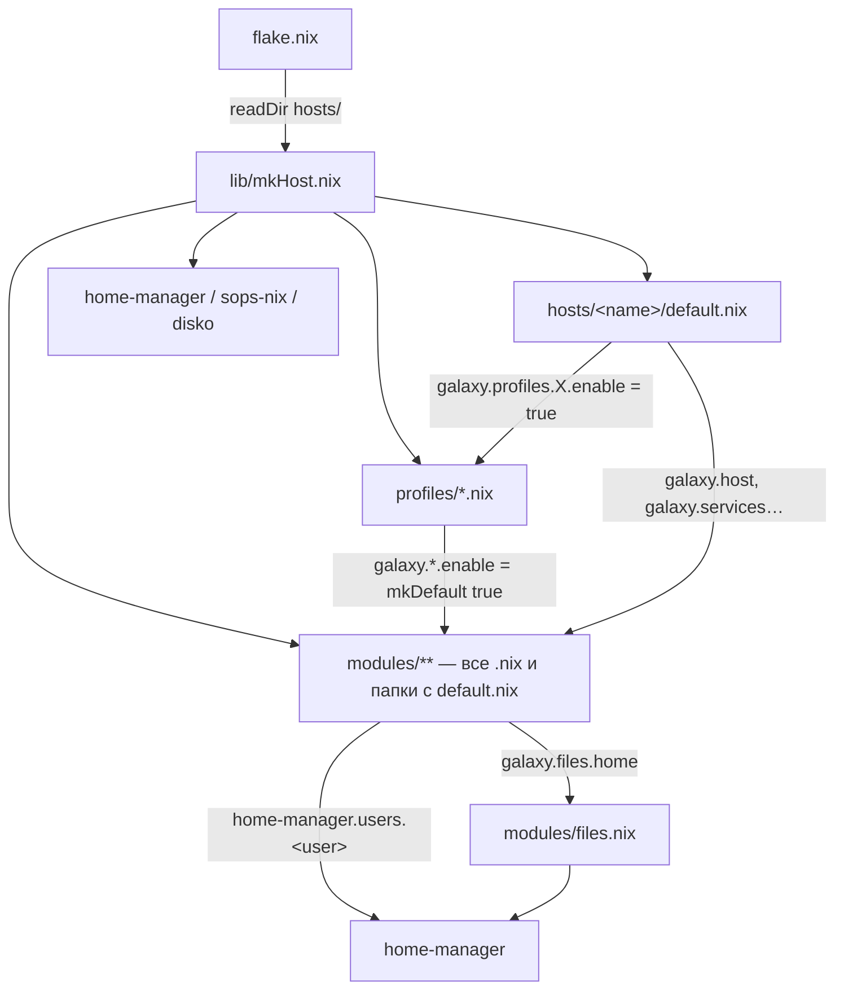

# Архитектура

## 1. Слои



| Слой | Где | Что делает | Чего не делает |
| --- | --- | --- | --- |
| Хост | `hosts/<name>/default.nix` | Описывает машину: GPU, DPI, мониторы, пользователь, сеть, профиль, отдельные сервисы | Не настраивает программы напрямую |
| Профиль | `profiles/*.nix` | Включает наборы модулей через `lib.mkDefault` | Не содержит настроек программ |
| Модуль | `modules/**` | Объявляет опцию `galaxy.…` и настраивает NixOS/HM, когда она включена | Не включается сам (кроме `modules/core/nix.nix` и модулей-опций) |
| Библиотека | `lib/` | Функции: `mkHost`, `listModules`, `linkTree`, `mkScript`, `hexToRgb`, генератор xray | Не зависит от `config` |
| Пакеты | `pkgs/` | Overlay: форки suckless и маленькие обёртки | — |

## 2. Как собирается хост

### flake.nix

```nix
hosts    = attrNames (filterAttrs (_: type: type == "directory") (readDir ./hosts));
machines = genAttrs hosts (name: galaxyLib.mkHost { inherit name inputs self; });

nixosConfigurations = machines // { dash = machines.alderaan; };
checks.x86_64-linux = mapAttrs (_: m: m.config.system.build.toplevel) machines;
formatter.x86_64-linux = pkgs.nixfmt-tree;
overlays.default = import ./pkgs inputs;
```

- Новый хост = новая папка в `hosts/`. Править `flake.nix` не нужно.
- `dash` — алиас: у ноутбука `alderaan` hostname по-прежнему `dash`, а `nh os switch`
  ищет конфигурацию по hostname.
- `checks` включают toplevel каждого хоста, поэтому `nix flake check` вычисляет (а без
  `--no-build` — собирает) всё.

### lib/mkHost.nix

`mkHost { name; inputs; self; }` вызывает `lib.nixosSystem` со списком модулей:

1. Встроенный модуль:
   - `options.galaxy.lib` (read-only) — всё из `lib/default.nix`, доступно как `config.galaxy.lib`;
   - `networking.hostName = mkDefault name` — hostname = имя папки, хост может перекрыть;
   - `nixpkgs.hostPlatform = "x86_64-linux"`.
2. `hosts/<name>` — сам хост.
3. Внешние модули: `home-manager`, `sops-nix`, `disko`. Подключены на всех хостах,
   но без настроек ничего не делают.
4. `listModules ../modules` и `listModules ../profiles`.

`specialArgs` (доступны во всех модулях как аргументы функции):

| Аргумент | Что это |
| --- | --- |
| `inputs` | Все входы flake (`inputs.dwm`, `inputs.textfoxy`, …) |
| `self` | Сам flake. Используется для ссылок на другие хосты (`self.nixosConfigurations.jedha.config…`) и для путей в репо (`galaxy.files.mutable`, копия репо на серверах) |
| `pkgs-pinned` | `nixpkgs-pinned` (nixos-26.05) с `allowUnfree`, для пакетов, которые нужно держать на стабильной ветке |

### Автоимпорт: `listModules`

```
modules/
  host.nix                 → импорт
  core/                    → нет default.nix → заходит внутрь
    boot.nix               → импорт
  programs/kitty/          → есть default.nix → импорт папки, внутрь не заходит
    config/kitty.conf      → не .nix, игнорируется
  services/llm/            → есть default.nix → импорт; он сам импортирует llama-swap/, open-webui.nix, librechat.nix
  desktop/media/           → нет default.nix, нет .nix → ничего
```

Правило: файл `*.nix` — модуль. Папка с `default.nix` — модуль, внутрь не заходим (там
могут лежать не-модули, например `librewolf/settings.nix` или `mpv/config/`). Папка без
`default.nix` — просматривается дальше.

Следствие: **любой .nix-файл в `modules/` и `profiles/` обязан быть NixOS-модулем**.
Вспомогательные файлы (`settings.nix`, `tabs-switcher.nix`, `rofi-pass/config.nix`,
`llm/pi.nix`) лежат только внутри папок с `default.nix`.

## 3. Опции и приоритеты

Каждый модуль устроен одинаково:

```nix
{ config, lib, pkgs, ... }:
{
  options.galaxy.programs.kitty.enable = lib.mkEnableOption "kitty";

  config = lib.mkIf config.galaxy.programs.kitty.enable {
    environment.systemPackages = [ pkgs.kitty ];
    galaxy.files.home.".config/kitty/kitty.conf" = ./config/kitty.conf;
    home-manager.users.${config.galaxy.host.user}.programs.zsh.initContent = "…";
  };
}
```

Кто выигрывает, если значение задано в нескольких местах:

| Приоритет | Где | Пример |
| --- | --- | --- |
| `mkDefault` (1000) | профили, `galaxy.host.*` по умолчанию | `galaxy.programs.kitty.enable = mkDefault true` в `profiles/desktop.nix` |
| обычный (100) | хост, модули | `galaxy.services.zapret.testTools = false` в `hosts/alderaan` |
| `mkForce` (50) | точечно в модулях | `grub.enable = mkForce false` при systemd-boot |

Важно про списки: определение с `mkDefault` **выбрасывается целиком**, если есть хоть
одно обычное. Поэтому:

- `galaxy.network.tcpPorts` в профиле задан через `mkDefault`: хост, задав свой список,
  заменяет его полностью (так сделано на jedha и mos-eisley);
- списки пакетов (`environment.systemPackages`) никогда не пишутся через `mkDefault`, они
  лежат в модулях и просто складываются.

### Порядок включения на примере barnard

```
hosts/barnard:  galaxy.profiles.desktop.enable = true
profiles/desktop.nix (mkIf desktop.enable):
    galaxy.programs.kitty.enable = mkDefault true
    galaxy.desktop.xserver.enable = mkDefault true
    …
modules/programs/kitty (mkIf kitty.enable): пакет, файлы, HM
modules/desktop/xserver.nix: читает galaxy.host.gpu/xftDpi/monitors
```

Профиль `base` включён всегда (`default = true`). Профиль `laptop` включается сам, если
`galaxy.host.isLaptop = true`.

## 4. home-manager

- Подключается модулем `modules/core/home.nix` при `galaxy.home.enable` (десктопный профиль):
  `useGlobalPkgs`, `useUserPackages`, `backupFileExtension = "backup"`, `stateVersion`,
  `extraSpecialArgs = { inherit inputs; }` (нужен textfoxy).
- Отдельной папки `home/` нет. Каждый модуль пишет свою HM-часть в
  `home-manager.users.${config.galaxy.host.user}`. NixOS сам сливает всё в одну
  HM-конфигурацию.
- Если HM-модулю нужен HM-`config` (например, `config.xdg.cacheHome` или
  `config.lib.file.mkOutOfStoreSymlink`), значение пишется функцией:

  ```nix
  home-manager.users.${user} = { config, ... }: { … config.xdg.cacheHome … };
  ```

  Внутри этой функции `config` — это HM-конфиг, а `user` берётся снаружи, из NixOS.
- Целый HM-модуль можно подключить через `imports`: так сделано с `services/llm/pi.nix`.

## 5. Overlay и пакеты

`modules/core/nix.nix` (включён всегда):

```nix
nixpkgs.config.allowUnfree = true;
nixpkgs.overlays = [
  (import ../../pkgs inputs)       # dwm, st, slock, dwmblocks, dmenu, ssh-term-fix
  inputs.better-swallow.overlay
  inputs.lazygit.overlays.default
];
```

`pkgs/default.nix` — функция `inputs: final: prev: { … }`. Каждый форк лежит в
`pkgs/<name>/default.nix` и вызывается через `final.callPackage` с `src = inputs.<name>`:

```nix
dwm = final.callPackage ./dwm { inherit (prev) dwm; src = inputs.dwm; };
```

Раньше `pkgs` для каждого хоста создавался в `flake.nix` и передавался в `nixosSystem`.
Теперь pkgs создаёт сам NixOS из `nixpkgs.config` и `nixpkgs.overlays`.

Сборки, нужные только одному модулю, лежат в этом модуле, а не в overlay:
`mpv-config` в `programs/mpv`, llama-cpp с ROCm в `services/llm/llama-swap`.

## 6. Связи между модулями

| Кто читает | Что | Откуда |
| --- | --- | --- |
| xserver, dunst, kitty, rofi (font.rasi) | `galaxy.host.fontSize`, `xftDpi`, `dpi` | `modules/host.nix` |
| xserver (xrandr), sddm (выключение мониторов на экране входа) | `galaxy.host.monitors` | хост |
| xserver (`videoDrivers`), `hardware/amd.nix`, `hardware/nvidia.nix` | `galaxy.host.gpu` | хост |
| statusbar (`db-battery`), xserver (тачпад), профиль laptop | `galaxy.host.isLaptop` | хост |
| session, dwm, dunst, kitty, rofi, zathura, flameshot, librewolf | `galaxy.theme.colors`, `galaxy.theme.font` | `modules/theme.nix` |
| rofi-wifi (по умолчанию) | `galaxy.network.wifi.enable && galaxy.programs.rofi.enable` | профили |
| rofi-pass | HM `programs.rofi.extraConfig` (клавиши) | `programs/rofi` |
| syncthing (`systemUser`) | `galaxy.profiles.server.enable` | профиль |
| навидром → koito | `galaxy.expose.koito.port` (ListenBrainz URL) | `services/koito.nix` |
| nginx на mos-eisley | `self.nixosConfigurations.jedha.config.galaxy.expose` | другой хост |
| xray (portal) | то же + `galaxy.lib.xray` | другой хост + lib |
| xray (генерация) | включает `galaxy.sops.enable` | `core/sops.nix` |
| librechat, pi, open-webui | `services.llama-swap.port` (11434), SearXNG 11433 | llm, searxng |
| zsh | подключает `~/.config/zsh/zshrc` через `source` | `galaxy.files` |
| kitty, llm | добавляют строки в HM `programs.zsh` (интеграция kitty, алиас `llm-off`) | zsh |

### Ссылки между хостами

`self` в `specialArgs` позволяет одному хосту читать вычисленный конфиг другого:

```nix
# modules/services/nginx.nix на mos-eisley
exposed = self.nixosConfigurations.${cfg.from}.config.galaxy.expose;   # from = "jedha"
```

Это работает лениво: из jedha вычисляется только `galaxy.expose`, не весь toplevel.
Условие — не должно быть цикла (jedha ничего не читает у mos-eisley).
