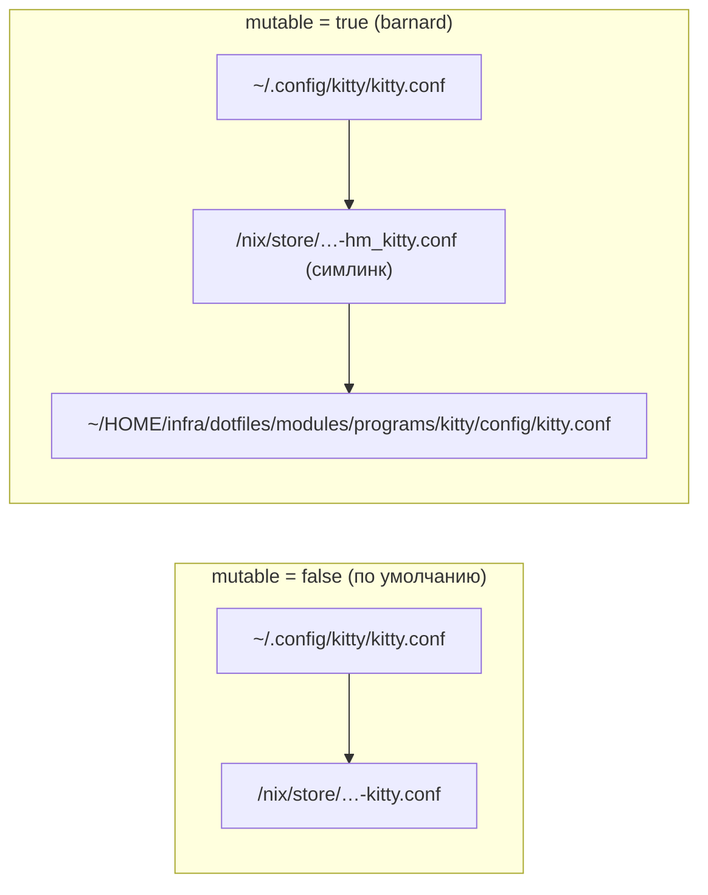

# Файлы в $HOME и тема

## galaxy.files

Все конфиги из репо, которые попадают в `$HOME`, проходят через одну опцию:

```nix
galaxy.files.home = {
  ".config/kitty/kitty.conf" = ./config/kitty.conf;   # файл из репо
  ".config/kitty/theme.conf" = theme;                 # сгенерированный файл (derivation)
};
```

`modules/files.nix` превращает это в `home-manager.users.<user>.home.file`. home-manager
создаёт симлинки при активации, следит за конфликтами и удаляет старые ссылки.

### Store-режим и mutable-режим



- `mutable = false`: ссылка ведёт в store. Правка файла в репо применяется после `switch`.
- `mutable = true`: для каждого файла из репо используется
  `config.lib.file.mkOutOfStoreSymlink (repoPath + <путь внутри репо>)`. Ссылка ведёт в
  рабочую копию, правка видна сразу, без пересборки.

Как модуль определяет «файл из репо»: путь начинается с `toString self` (путь flake в
store). Относительный путь получается через `removePrefix`, к нему приписывается
`galaxy.files.repoPath`. Сгенерированные файлы (`pkgs.writeText …`) лежат вне `self`,
поэтому **всегда** берутся из store, даже при `mutable = true`.

Что учитывать в mutable-режиме:

- Рабочая копия должна лежать по `repoPath` (по умолчанию `~/HOME/infra/dotfiles`).
  Если её нет, ссылки будут битыми.
- Новый файл в папке (например, новый `lua/plugins/foo.lua`) требует одного `switch`:
  список ссылок строится при вычислении. Дальше файл правится без пересборки.
- Файлы, встроенные в derivation, от режима не зависят: `picom.conf` (вклеивается в HM-конфиг),
  mpv (собирается в `mpv-config`), zsh-плагины.

### linkTree

`galaxy.lib.linkTree target src` разворачивает папку в отдельные файлы:

```nix
galaxy.lib.linkTree ".config/nvim" ./config
# => { ".config/nvim/init.lua" = ./config/init.lua;
#      ".config/nvim/lua/lsp.lua" = ./config/lua/lsp.lua; … }
```

Зачем по файлу, а не всю папку одной ссылкой:

1. Рядом можно положить сгенерированные файлы. В `~/.config/rofi/` лежат ссылки на
   `config/*.rasi` из репо плюс `colors.rasi` и `font.rasi` из store, плюс `config.rasi`
   от home-manager.
2. mutable-режим работает для каждого файла отдельно.

Где используется: `neovim` (`~/.config/nvim`), `rofi` (`~/.config/rofi`),
`desktop/media.nix` (`~/.local/media`).

### Какие файлы куда попадают

| Путь в $HOME | Источник | Модуль |
| --- | --- | --- |
| `.config/kitty/kitty.conf` | `programs/kitty/config/kitty.conf` | kitty |
| `.config/kitty/theme.conf` | генерируется из темы и `fontSize` | kitty |
| `.config/zsh/zshrc` | `programs/zsh/config/zshrc` | zsh |
| `.p10k.zsh` | `programs/zsh/config/p10k.zsh` | zsh |
| `.config/nvim/**` | `programs/neovim/config/**` | neovim |
| `.config/rofi/*.rasi` | `programs/rofi/config/*.rasi` | rofi |
| `.config/rofi/colors.rasi`, `font.rasi` | генерируются | rofi |
| `.local/media/**` | `desktop/media/**` | desktop/media.nix |
| `.librewolf/<profile>/customKeys.json`, `.mozilla/firefox/<profile>/customKeys.json` | `programs/librewolf/config/customKeys.json` | librewolf |

Остальное пишет сам home-manager из опций (`.zshrc`, `rofi/config.rasi`, dunst, picom,
flameshot, gtk, `.Xresources`, `.Xmodmap`, `greenclip.toml`, `rofi-pass/config`, mpv, yazi,
профили браузера). Это не `galaxy.files`, mutable на них не действует.

`programs/librewolf/config/{sidebery,vimium,mtab}.*` — резервные копии настроек
расширений для ручного импорта. Никуда не ссылаются.

### Почему zshrc подключается через source

Раньше содержимое `zshrc` вклеивалось в `.zshrc` (`initContent = readFile ./zshrc`),
поэтому любая правка требовала пересборки. Теперь HM-`.zshrc` содержит строку

```sh
source ~/.config/zsh/zshrc
```

а сам файл приходит через `galaxy.files`. Тот же код, только подключён как отдельный
файл. На barnard правится без `switch`.

### Почему у neovim отключён init.lua от home-manager

`programs.neovim` в home-manager пишет свой `~/.config/nvim/init.lua` (только отключение
провайдеров). В старом конфиге он конфликтовал с вашим `init.lua`, и ваш побеждал. Теперь
конфликт убран явно: `xdg.configFile."nvim/init.lua".enable = mkForce false`.

## Тема

`modules/theme.nix` — единственное место с цветами (gruvbox dark с более тёмным фоном
`#171717`) и основным шрифтом.

```nix
let c = config.galaxy.theme.colors; in
"background ${c.bg}"
```

| Кто | Что берёт | Как |
| --- | --- | --- |
| консоль (`desktop/session.nix`) | 16 цветов | `console.colors` |
| `.Xresources` (dwm, st, dmenu) | `bg`, `bg1`, `fg`, `fg0`, `orange`, шрифт | текст в `desktop/dwm.nix` |
| kitty | `bg`, `fg`, шрифт, `fontSize` | генерирует `theme.conf`, туда же `include` gruvbox-dark из `kitty-themes` |
| rofi | `bg`, `bg0`, `fg`, `fg0`, `orange` → `colors.rasi`; шрифт + `fontSize` → `font.rasi` | `galaxy.lib.hexToRgb` для `rgb(r, g, b, 0.9)` |
| dunst | `bg0`, `fg`, `fg0`, `orange`, шрифт + `fontSize` | HM settings |
| zathura | `bg0_h`, `bg0`, `bg1`, `fg`, `fg0`, `fg2`, `red`, `yellow`, `orange` | HM options |
| flameshot | 13 цветов палитры, `orange` | HM settings |
| textfoxy (librewolf) | `bg0`, `orange`, `bg1` | `background.color`, CSS-переменные |

Все `.rasi` в `rofi/config/` делают `@import "colors.rasi"` и `@import "font.rasi"`
(через `theme.rasi`), поэтому смена темы или DPI меняет все меню сразу.

### Как DPI влияет на шрифты

```
galaxy.host.dpi = "high"
  → xftDpi = 192   → services.xserver.dpi, XFT_DPI, QT_SCREEN_SCALE_FACTORS="2;2"
  → fontSize = 14  → kitty font_size, rofi font.rasi, dunst font
```

Оба значения можно переопределить в хосте: `galaxy.host.fontSize = 12;`.

Раньше это были три отдельные опции `videoDrivers`, `dpi`, `fontSize` в
`nixos/config/<host>.nix`, а для rofi было два файла `font-dpi-low.rasi` /
`font-dpi-high.rasi` и выбор по `fontSize < 14`.
