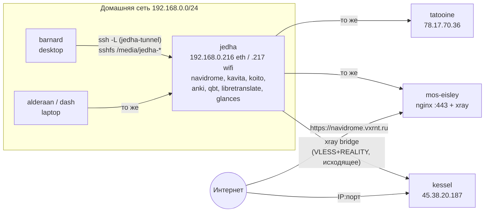

# Сеть, публикация сервисов, секреты

## Общая схема



jedha стоит за NAT, поэтому сам открывает туннели к VPS, а VPS отдают трафик обратно
через эти туннели.

## Модуль сети (`modules/core/network.nix`)

Три уровня:

1. **`galaxy.network.enable`** (профиль base, все хосты): `useNetworkd`, resolved,
   firewall с `allowPing` и портами из `tcpPorts`/`udpPorts`, сети из `interfaces`.
2. **`client.enable`** (desktop, server): без NetworkManager и DHCP в ядре,
   `nameservers` и `FallbackDNS` = Quad9, `Domains = ~.`, без LLMNR и `wait-online`.
   Без `client` (VPS): `wireless.enable = false`, IPv6 включён, `wait-online.anyInterface`.
3. **`wifi.enable`** (desktop, laptop): iwd со случайным MAC на каждую сеть,
   `EnableNetworkConfiguration = false` (адреса раздаёт networkd).

`interfaces` → `systemd.network.networks`:

| Хост | Unit | Match | Режим |
| --- | --- | --- | --- |
| barnard, alderaan | `10-eth` | `enp14s0` | DHCP, metric 20 |
| barnard, alderaan | `20-wifi` | `wlan0` | DHCP, metric 10 |
| jedha | `10-eth` | MAC `bc:c3:42:af:59:e6` | DHCP + статика `192.168.0.216/24`, шлюз `.1` |
| jedha | `20-wifi` | `wlan0` | DHCP + статика `192.168.0.217/24` |
| kessel | `10-eth` | `enp0s4` | статика `45.38.20.187/32` |
| tatooine | `10-eth` | `ens18` | статика `78.17.70.36/32` |
| mos-eisley | `10-eth` | `ens3` | статика `192.168.0.5/32` |

При `dhcp = true` в сеть пишется DHCP, DNS Quad9 с DNS-over-TLS, `IPv6AcceptRA`,
`UseDNS = false` (DNS от роутера игнорируется). При `dhcp = false` — только адрес,
маршрут и `dns`. Это ровно то, что было на VPS.

VPS дополнительно (`profiles/vps.nix`): `gai.conf` с приоритетом IPv4.

### Порты firewall

| Хост | Откуда | TCP | UDP |
| --- | --- | --- | --- |
| barnard, alderaan | `profiles/desktop.nix` | 7777 (terraria), 8384, 22000 (syncthing), 61208 (glances) | 7777, 21027, 22000 |
| jedha | хост | 22 80 443 4110 4533 4545 5201 5389 8129 8130 8208 8384 8392 8448 22000 42853 | те же без 22/80/443, плюс 21027 |
| kessel, tatooine | `profiles/vps.nix` | 22 80 443 4533 4545 8129 8130 8208 8443 8448 21027 22000 22067 22070 42853 | 8443 22000 22067 22070 42853 |
| mos-eisley | хост | как у VPS + 4110, 5389 | как TCP без 22/80/443 |

Модули могут сами открывать порты через `networking.firewall`: syncthing
(`openDefaultPorts`), navidrome, qbittorrent (`openFirewall`), virtualisation
(`trustedInterfaces = [ "virbr0" ]`). Эти списки складываются с `galaxy.network.*Ports`.

## galaxy.expose

Сервис на jedha сам объявляет, что его нужно публиковать:

```nix
# modules/services/navidrome.nix
galaxy.expose.navidrome = { port = 4533; subdomain = "navidrome"; };
services.navidrome.settings.Port = config.galaxy.expose.navidrome.port;
```

Сейчас на jedha:

| Сервис | Порт | Поддомен |
| --- | --- | --- |
| navidrome | 4533 | `navidrome.vxrnt.ru` |
| kavita | 4545 | `kavita.vxrnt.ru` |
| qbittorrent | 8129 | `qbt.vxrnt.ru` |
| anki | 8130 | `anki.vxrnt.ru` |
| koito | 4110 | `koito.vxrnt.ru` |
| libretranslate | 5389 | `lt.vxrnt.ru` |
| glances | 8208 | — (только туннель) |

Порт задаётся один раз. Сервис, nginx на mos-eisley и генератор xray берут его отсюда.
Navidrome также берёт отсюда адрес koito для ListenBrainz.

Чтобы опубликовать новый сервис, достаточно добавить `galaxy.expose.<имя>` в его модуль
(плюс порт в firewall VPS, если нужен прямой доступ по IP).

## nginx на mos-eisley (`modules/services/nginx.nix`)

```
:443 ──ssl_preread──┬─ vxrnt.ru, www, *.vxrnt.ru из expose ─→ 127.0.0.1:8443 (nginx TLS, ACME)
                    │                                          └─ proxy_pass http://127.0.0.1:<port>
                    └─ всё остальное ────────────────────────→ 127.0.0.1:10443 (xray)
```

- `stream`-блок разбирает SNI без расшифровки. Известные имена идут в nginx, остальные
  (REALITY-клиенты) — в xray.
- vhost-ы строятся из `self.nixosConfigurations.jedha.config.galaxy.expose`: каждая
  запись с `subdomain` даёт `<subdomain>.vxrnt.ru` → `127.0.0.1:<port>`, с websockets,
  без лимита на размер тела, таймаут 3600 с.
- На `127.0.0.1:<port>` на mos-eisley слушает xray (dokodemo-door) и отправляет соединение
  в туннель до jedha.
- Корневой сайт `vxrnt.ru` отдаётся из `/var/www/vxrnt.ru`.

Опции: `domain` (`vxrnt.ru`), `from` (`jedha`), `acmeEmail`.

## Xray

### Сейчас

На всех четырёх хостах (`jedha`, `kessel`, `tatooine`, `mos-eisley`) задано
`legacyConfig = ./xray.json`: работает старый зашифрованный git-crypt конфиг, ничего не
генерируется. Модуль при этом:

- на `role = "portal"` (VPS) добавляет `pkgs.xray` в систему и systemd-настройки:
  `RuntimeDirectory=xray`, `RuntimeMaxSec=30min`, `Restart=always` (как было);
- на jedha (`role = "bridge"`) ничего не добавляет (как было).

### Генератор (`lib/xray.nix`)

Использует **VLESS reverse proxy**. В актуальном xray старый верхнеуровневый блок
`"reverse": { "bridges"/"portals" }` удалён, конфиг с ним не запускается.

**portal** (VPS):

```
inbound vless-in (REALITY, :443 или 127.0.0.1:10443 за nginx)
  clients:
    bridge  id=@secret:bridge_uuid@   reverse.tag = "tunnel"   ← подключается jedha
    <user>  id=@secret:user_<user>@                          ← личные устройства
inbound expose-<svc> (dokodemo-door, :<port>) → 127.0.0.1:<port> на стороне bridge
routing: expose-* → "tunnel"; geoip:private → block
```

Когда jedha подключается пользователем `bridge`, у portal появляется виртуальный
outbound `tunnel`. Соединения с dokodemo-портов уходят в него.

**bridge** (jedha):

```
outbound to-<portal> (vless, плоский формат, REALITY)
  id=@secret:bridge_uuid_<portal>@, reverse.tag = "from-<portal>"
routing: from-* → direct
```

Outbound с `reverse` сам поднимает соединения к portal (проверка каждые 2 с, новое
соединение, если на воркер приходится больше 16). Пришедший обратно трафик помечается
inbound-тегом `from-<portal>` и уходит в `direct`, то есть на `127.0.0.1:<port>` jedha.

Проверено: оба сгенерированных конфига проходят `xray run -test` (xray 26.9.9).
Живой туннель в песочнице не подтверждён — проверяйте на железе.

### Секреты в рантайме

Генератор оставляет в JSON строки `"@secret:<name>@"` и отдаёт список `secrets`.
Модуль:

1. объявляет `sops.secrets."xray/<name>"` (с `restartUnits = [ "xray.service" ]`);
2. передаёт их в сервис через `LoadCredential`, поэтому `DynamicUser` может их прочитать;
3. в `ExecStartPre` запускает jq, который заменяет `@secret:…@` на содержимое файлов из
   `$CREDENTIALS_DIRECTORY` и пишет `/run/xray/config.json`;
4. `services.xray.settingsFile = "/run/xray/config.json"`.

В store попадает только шаблон без секретов.

| Роль | Секреты |
| --- | --- |
| portal | `xray/reality_private_key`, `xray/short_id`, `xray/bridge_uuid`, `xray/user_<name>` |
| bridge | `xray/bridge_uuid_<portal>`, `xray/short_id_<portal>` (публичный ключ portal — обычная опция `publicKey`) |

### Переход на генератор

1. Сгенерировать ключи: `xray x25519`, `xray uuid`, short id (`openssl rand -hex 8`).
2. Положить секреты в sops-файл хоста. Для VPS: `secrets/<host>.yaml` (правила уже
   есть в `.sops.yaml` для kessel и tatooine; для mos-eisley правило нужно добавить) и
   `galaxy.sops.file = ../../secrets/<host>.yaml`. На VPS расшифровка идёт ssh host key
   (`useHostKey` из профиля vps).
3. В хосте заполнить `portal.dest`, `portal.serverNames`, `portal.users`. Для mos-eisley
   `portal.listen = "127.0.0.1"; portal.port = 10443;`. На jedha заполнить `bridge.portals`.
4. Убрать `legacyConfig`. Без него модуль потребует недостающие опции
   (`option … is used but not defined`), это подсказка, что осталось заполнить.

## jedha-tunnel (`modules/services/jedha-tunnel.nix`)

На десктопах (профиль desktop):

- обычный пользователь `tunneluser` с ключом `~tunneluser/.ssh/id_ed25519` (сам ключ
  кладётся руками, tmpfiles создаёт только каталог и файл с правами 600);
- сервис `jedha-tunnel`: `ssh -N jedha@192.168.0.217` с пробросами
  18384→8384 (GUI syncthing на jedha), 8129, 8130, 4544, 4545, 4533, 4110 на localhost;
- sshfs-монтирования по запросу (automount, отключение через 10 минут простоя):
  `/media/jedha-music`, `/media/jedha-books`, `/media/jedha-programming-books`.

## Остальные сетевые сервисы

| Что | Где | Суть |
| --- | --- | --- |
| zapret-discord-youtube | desktop, jedha | Обход DPI, конфиг `general(ALT)` |
| throne (TUN) + v2rayN | `programs/shell-proxy` | Локальный прокси `127.0.0.1:10808`; бинари xray/sing-box подложены в `~/.local/share/v2rayN/bin` |
| proxychains | `programs/shell-proxy` | `socks5 127.0.0.1 10808` |
| `source shell-proxy` | `programs/shell-proxy` | `http(s)_proxy`, `all_proxy` в текущей оболочке |
| LibreChat | `services/llm` | Ходит наружу через `PROXY=http://127.0.0.1:10808` |

## Секреты (sops-nix)

- `modules/core/sops.nix`: `defaultSopsFile = galaxy.sops.file` (по умолчанию
  `secrets/barnard.yaml`), формат yaml.
- Ключ: на десктопах генерируется age-ключ в `/var/lib/sops-nix/key.txt`; на jedha и VPS
  используется `/etc/ssh/ssh_host_ed25519_key`.
- Кому можно расшифровывать — `.sops.yaml` (barnard + jedha для `barnard.yaml`,
  `jedha.yaml`, `alderaan.yaml`; отдельные правила для kessel и tatooine).
- `secrets/**` и `hosts/*/xray.json` дополнительно зашифрованы git-crypt
  (`.gitattributes`).

Кто что читает из `secrets/barnard.yaml`:

| Секрет | Хост | Модуль |
| --- | --- | --- |
| `searxng-env` | barnard | searxng |
| `librechat/*`, `meilisearch/master_key` | barnard | llm/librechat |
| `anki-pwd` | jedha | anki |
| `koito/env` | jedha | koito |
